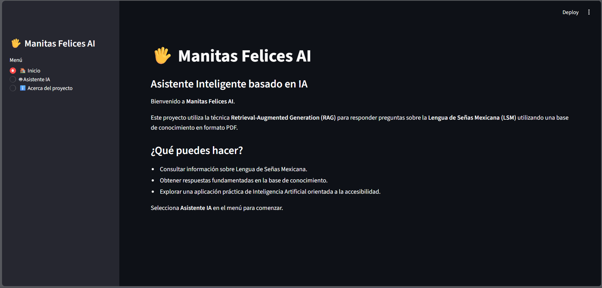
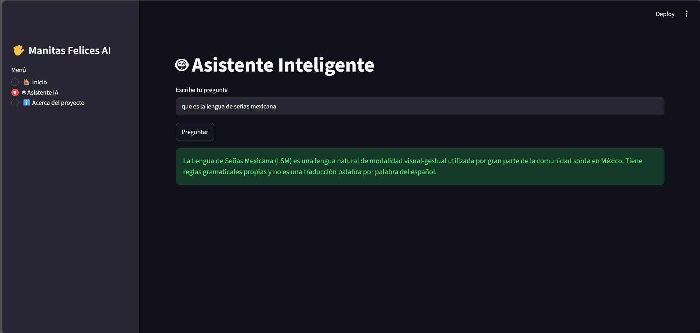
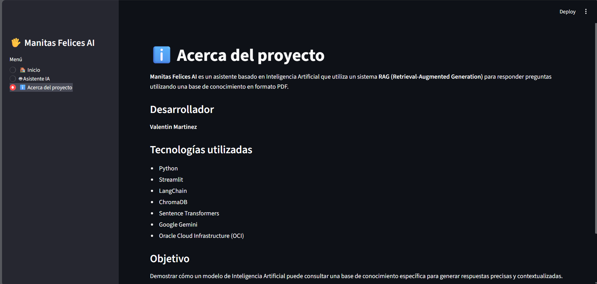

#  Manitas Felices AI

**Manitas Felices AI** es un asistente inteligente desarrollado con **Python**, **Streamlit**, **LangChain**, **ChromaDB** y **Google Gemini**, capaz de responder preguntas utilizando una base de conocimiento sobre la **Lengua de Señas Mexicana (LSM)** mediante la técnica **Retrieval-Augmented Generation (RAG)**.

---

##  Descripción

El objetivo de este proyecto es demostrar cómo la Inteligencia Artificial puede utilizar una base de conocimiento específica para responder preguntas de forma precisa y contextualizada.

El sistema procesa documentos PDF, genera embeddings mediante modelos de **Sentence Transformers**, almacena la información en una base vectorial utilizando **ChromaDB** y emplea **Google Gemini** para generar respuestas únicamente con el contexto recuperado.

---

#  Características

-  Lectura de documentos PDF.
-  División automática del contenido en fragmentos (Chunks).
-  Generación de embeddings mediante Sentence Transformers.
-  Almacenamiento de información en ChromaDB.
-  Recuperación semántica de información (Retriever).
-  Generación de respuestas con Google Gemini.
-  Interfaz gráfica desarrollada con Streamlit.

---

#  Arquitectura

```
Usuario
    │
    ▼
Interfaz (Streamlit)
    │
    ▼
Retriever
    │
    ▼
ChromaDB
    │
    ▼
Contexto Recuperado
    │
    ▼
Google Gemini
    │
    ▼
Respuesta
```

---

#  Estructura del proyecto

```
ManitasFelices-AI/
│
├── app/
│   └── services/
│       ├── gemini_service.py
│       ├── pdf_service.py
│       ├── rag_service.py
│       ├── retriever_service.py
│       └── vector_service.py
│
├── data/
│   ├── chroma/
│   └── knowledge_base/
│
├── screenshots/
│
├── scripts/
│   └── crear_vector_db.py
│
├── .gitignore
├── main.py
├── requirements.txt
└── README.md
```

---

#  Tecnologías utilizadas

- Python
- Streamlit
- LangChain
- ChromaDB
- Sentence Transformers
- Google Gemini
- HuggingFace Embeddings
- Python Dotenv

---

#  Instalación

## 1. Clonar el repositorio

```bash
git clone https://github.com/VSMartinezcpp/ManitasFelices-AI.git

cd ManitasFelices-AI
```

## 2. Crear un entorno virtual

```bash
python -m venv venv
```

### Windows

```bash
venv\Scripts\activate
```

### Linux / macOS

```bash
source venv/bin/activate
```

## 3. Instalar dependencias

```bash
pip install -r requirements.txt
```

## 4. Configurar la API Key

Crear un archivo **.env**

```env
GEMINI_API_KEY=TU_API_KEY
```

---

#  Ejecutar la aplicación

```bash
streamlit run main.py
```

---

# Capturas

### Pantalla principal



### Asistente IA



### Acerca del proyecto


---

#  Mejoras futuras

- Soporte para múltiples documentos PDF.
- Historial de conversaciones.
- Carga dinámica de documentos desde la interfaz.
- Mejoras en la interfaz gráfica.
- Soporte para diferentes modelos de lenguaje.

---

#  Autor

**Valentin Martinez**

Proyecto desarrollado como parte del programa **Oracle Next Education (ONE)**.

---

#  Licencia

Este proyecto fue desarrollado con fines educativos.